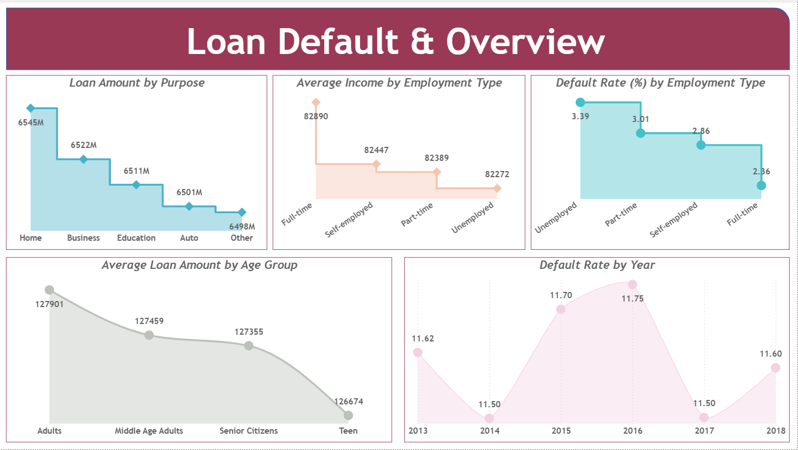

# 📊 Credit Risk & Loan Default Analysis

## 📊 Dashboard Preview



---

## 📌 Project Overview

This project analyzes loan default patterns and identifies key factors contributing to credit risk. It is designed as an end-to-end data analytics solution using SQL, Power BI, and Dataflows.

The objective is to help financial institutions detect high-risk customers and make better lending decisions.

---

## 🎯 Business Objectives

* Identify key factors influencing loan default
* Segment customers based on risk levels
* Analyze relationships between income, loan amount, and default
* Deliver insights through interactive dashboards

---

## 🛠️ Tools & Technologies Used

* **SQL** → Data storage and querying
* **Power BI** → Dashboard creation and visualization
* **Power BI Dataflows** → Data transformation (ETL)
* **On-Premises Data Gateway** → Secure data connectivity
* **Excel / CSV** → Raw data source

---

## 🔄 Data Pipeline Architecture

1. Raw dataset collected in CSV format
2. Data loaded into SQL database
3. Data transformed using Power BI Dataflows
4. On-Premises Data Gateway used for secure connection
5. Data visualized in Power BI dashboards

---

## 📊 Dashboard Features

* Loan default rate analysis
* Customer segmentation (income, education, employment)
* Credit score vs default trends
* Debt-to-Income (DTI) ratio analysis
* Region-based risk distribution

---

## 📈 Key Insights

* Low-income customers with higher loan amounts show increased default risk
* Higher DTI ratio strongly correlates with loan default
* Credit score is a major indicator of repayment behavior
* Certain employment categories have higher default rates

---

## 📁 Project Structure

```
credit-risk-loan-default-analysis
│
├── Project/
│   └── Loan_Default_Dashboard.pbix
│
├── Dataset/
│   └── Loan_default.zip
│
└── Reports/
    ├── Loan Default & Overview.png
    └── Application Demographics & Financial Profile.png
    └── Financial Risk Metrics.png
```

---

## 🚀 How to Use

1. Download the `.pbix` file from the **project/** folder
2. Extract the dataset from `dataset/Loan_Default_Data.zip`
3. Open the file in Power BI Desktop
4. Update data source path if required
5. Explore the dashboard

---

## 💡 Future Improvements

* Add machine learning model for default prediction
* Automate data refresh using cloud integration
* Enhance dashboard with advanced DAX calculations

---

## 👤 Author

**Mehtab**
Aspiring Data Analyst | SQL | Power BI | Data Analytics

---
